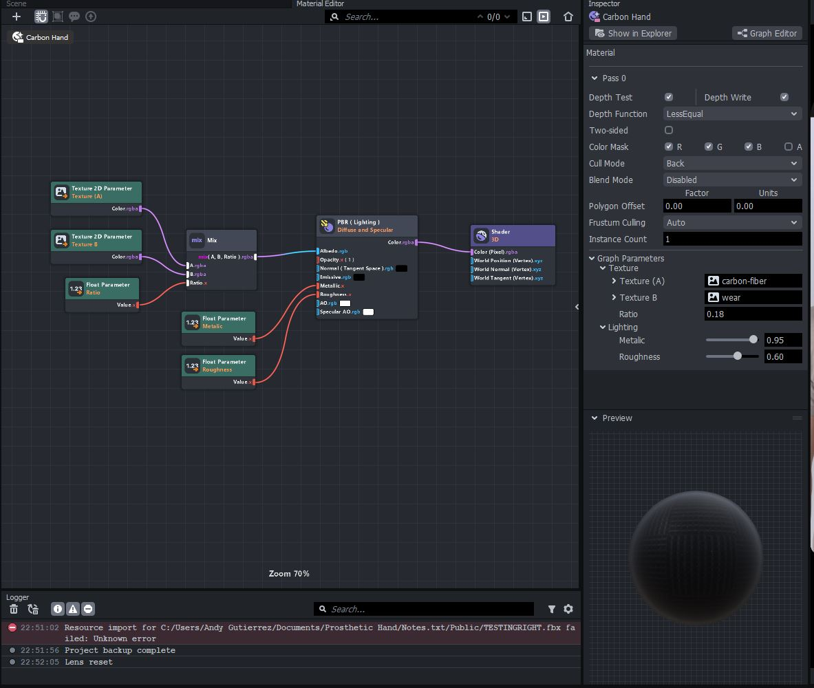
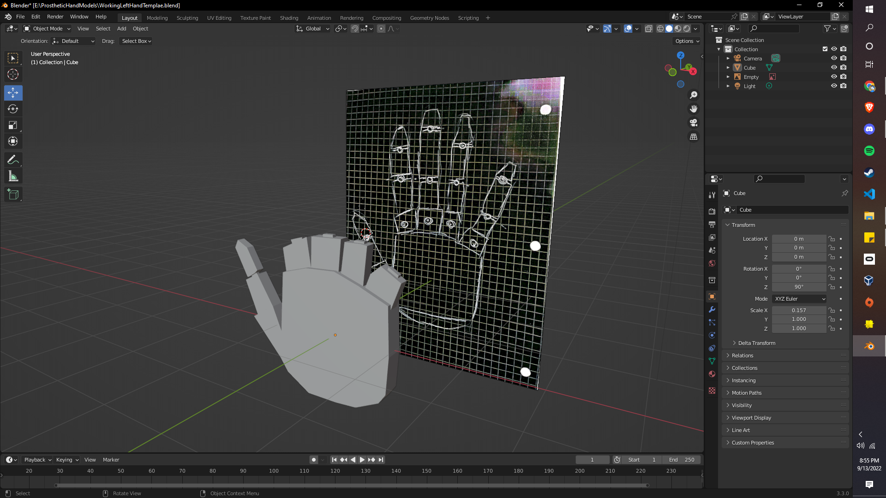
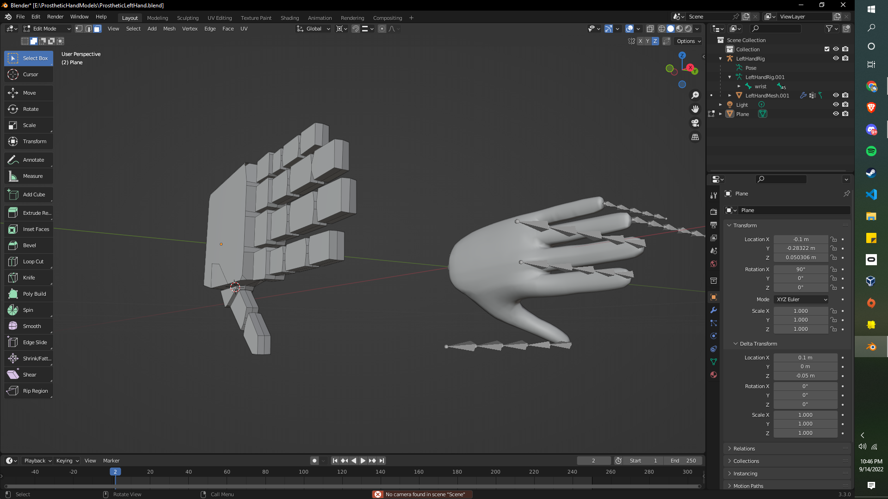
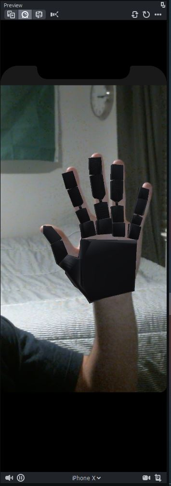
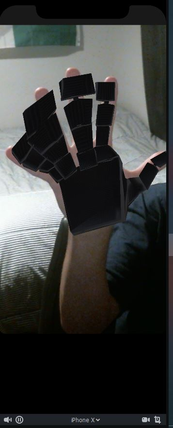

# snap-filter
This is a hackathon entry for Snapchat's Snap Spotlight Lensathon
using Snapchat's official application, Lens Studio

  ## Project Purpose
   The idea is to create a filter that educates and normalizes 
   the concept of a prosthetic hand through Snapchat's filters 
   that overlays the user's own hand with that of a prosthetic
   
  ## Project Clarifications and Fair Use
  > The base material for hand-tracking technology was iterated 
  > through the use of a Lens Studio provided template.
  > All textures used are based on the open source 

  ## Progression Snapshots 
  > Deciding on a project idea, I had to familiarize myself with Lens Studio,
  > the provided Snapchat Software to customize filters. Incorporating a template, I dissected
  > the elemts into their components, udnerstanding the conjunction of models, materials, and tracking.
  >
  > The intial curve was defining an established material to be laid on my prosthetic hand.
  >
  > 
  > 
  > Having decided on a pleasing texutre, I mnoved on and found the free-use tool, Blender, to model my subject hand.
  > Crossreferencing photos proved useful, but I attempted to mold a shape to a hand traced to my likeness.
  >
  > 
  >
  > However, lining my model up with little blender experience resulted in a few errors. The best method of approach was tracing 
  > the provided template and modifiying it to match the skeleton.
  >
  > 
  >
  > With some research, I was able to attach my model to that of the template's armature and succesfully applied 
  > the left hand model. However, modelling it over to the rigt hand proved more cumbersone and is still being progressed.
  >
  >  
